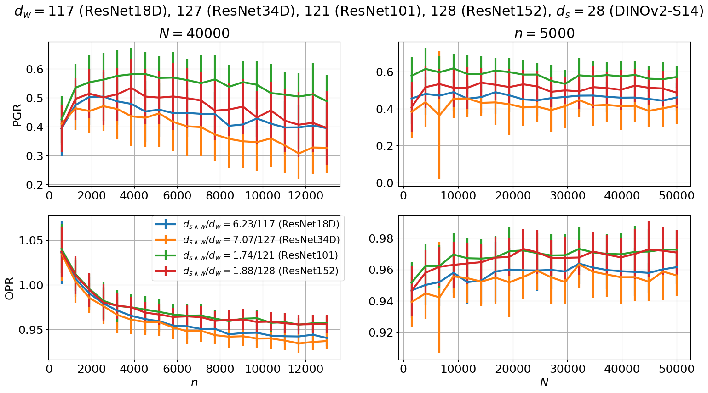
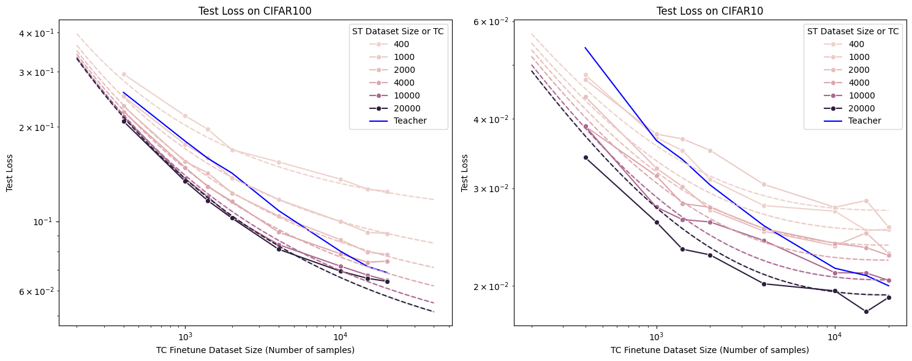

# weak-to-strong

This repository contains code for Discrepancies are Virtue: Weak-to-Strong Generalization through Lens of Intrinsic Dimension. 

The w2s folder contains scripts used for experiments on NLP tasks and follows the setup of [EleutherAI / w2s](https://github.com/EleutherAI/w2s).
The domainbed folder contains code modified from [facebookresearch / DomainBed](https://github.com/facebookresearch/DomainBed) to experiment on CV tasks. Code for evaluating intrinsic dimension and correlation dimension is also included in this folder.

Some Results

We build upon or make use of the following existing repositories:

- [EleutherAI / w2s](https://github.com/EleutherAI/w2s) — This project (“Weak-to-Strong Generalization”) provided code and experimental setups that informed our experiments on NLP tasks. :contentReference[oaicite:0]{index=0}  
- [facebookresearch / DomainBed](https://github.com/facebookresearch/DomainBed) — A suite for benchmarking domain generalization algorithms. We used their code for visual tasks in the initial stage of our work. :contentReference[oaicite:1]{index=1}

## Authors
Yijun Dong,
Yicheng Li,
Yunai Li,
Jason D. Lee,
Qi Lei
